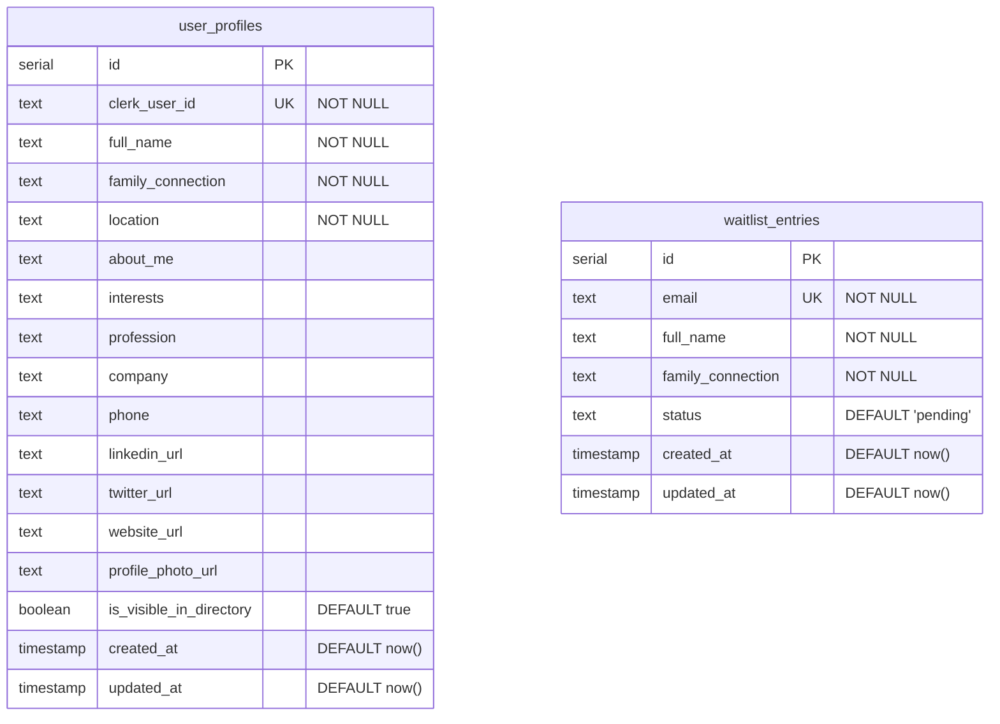

# feat: Database Integration & Custom Auth Components

## Overview

Connect Clerk authentication to a Vercel Postgres database (via Drizzle ORM) to support rich member profiles, replace all Clerk pre-built UI components with custom forms using Clerk's JavaScript SDK hooks, and build a members directory populated by live user data. This transforms the current placeholder members area into a fully functional, branded experience.

## Problem Statement

The MLN Museum currently uses Clerk's pre-built components (`<SignIn>`, `<Waitlist>`, `<UserButton>`) which provide limited design control and no extended profile storage. The members dashboard at `/members` is a placeholder showing only Clerk-native data (name, email, avatar). There is no database — all content comes from Sanity CMS, which is unsuitable for user-generated profile data.

Members need the ability to:
- Complete a rich sign-up capturing family connection, location, and other profile fields
- Edit their profile from a branded dashboard
- Appear in a members directory visible to other authenticated members
- Experience auth flows (sign-in, sign-up, user menu) that match the MLN Museum brand while feeling professional and trustworthy

## Proposed Solution

### Stack

| Layer | Technology | Rationale |
|-------|-----------|-----------|
| Database | Vercel Postgres (Neon) | First-party Vercel integration, auto-injected env vars, free tier |
| ORM | Drizzle ORM | TypeScript-native schemas, lightweight, excellent Next.js support |
| File Storage | Vercel Blob | First-party, simple API, automatic CDN |
| Auth UI | Clerk SDK hooks (`useSignIn`, `useSignUp`, `useUser`, `useClerk`) | Full design control; Clerk Elements is frozen and no longer maintained |
| Form Validation | Zod + React Hook Form | Type-safe validation, good DX, industry standard |
| Notifications | Sonner (already installed) | Toast feedback for form actions |

### Architecture Diagram

```
┌──────────────────────────────────────────────────────┐
│                    Client (Browser)                   │
│                                                       │
│  Custom Sign-In ──┐                                   │
│  Custom Sign-Up ──┤── Clerk SDK hooks ──► Clerk API   │
│  Custom Waitlist ─┘                                   │
│                                                       │
│  Dashboard ─────────► API Routes ──► Drizzle ──► DB   │
│  Directory ─────────► Server Components ──► DB        │
│  Photo Upload ──────► API Route ──► Vercel Blob       │
│  Navbar Menu ───────► useUser() + useClerk()          │
└──────────────────────────────────────────────────────┘

┌──────────────────────────────────────────────────────┐
│                    Server (Vercel)                     │
│                                                       │
│  /api/webhooks/clerk ◄── Clerk Webhooks               │
│       │                  (user.created, user.updated)  │
│       ▼                                               │
│  Drizzle ORM ──► Vercel Postgres (Neon)               │
│                                                       │
│  /api/upload/avatar ──► Vercel Blob Storage            │
│  /api/profiles/* ──► Drizzle ──► user_profiles         │
│  /api/waitlist/* ──► Drizzle ──► waitlist_entries       │
│  /api/admin/* ──► Clerk Invitation API + DB            │
└──────────────────────────────────────────────────────┘
```

## Technical Approach

### Database Schema (ERD)



### Key Design Decisions

1. **Upsert strategy**: Sign-up Step 2 uses `INSERT...ON CONFLICT (clerk_user_id) DO UPDATE` so it is safe regardless of whether the Clerk webhook has already created the record.

2. **Name sync**: When a user edits their name on the dashboard, both the DB (`full_name`) and Clerk (`firstName`/`lastName` via `useUser().update()`) are updated to keep a single source of truth.

3. **Invitation flow**: `signUp.create({ strategy: 'ticket', ticket })` skips email verification — the invitation link itself serves as email confirmation. No OTP step needed.

4. **Avatar priority**: DB `profile_photo_url` takes precedence over Clerk's `imageUrl`. Fallback chain: DB photo → Clerk avatar → initials placeholder.

5. **Directory visibility toggle**: Saves immediately on toggle (PATCH request) with optimistic UI — not part of the bulk profile save.

6. **Client-side fallback for missing DB records**: On dashboard load, if no `user_profiles` record exists for the authenticated user, redirect to a profile completion form (reuse Step 2 of sign-up).

7. **Post-sign-out redirect**: `/` (home page).

8. **Post-sign-in redirect preservation**: Custom sign-in form reads `redirect_url` from search params and passes it to `setActive()`.

9. **Profile photo constraints**: Max 5MB, accepted types: JPEG, PNG, WebP. Validated client-side (input `accept`) and server-side (Content-Type + size check). Old Blob objects deleted on re-upload via `del()`.

10. **Admin waitlist UI**: Minimal `/admin/waitlist` page protected by checking Clerk user's email against a hardcoded admin email list (or `publicMetadata.role === 'admin'`). Shows pending entries with Approve/Deny buttons.

11. **Delete account**: Deferred to a future phase. A disabled placeholder button shown in dashboard.

## Implementation Phases

### Phase 1: Database Foundation

Set up Vercel Postgres, Drizzle ORM, and the schema. This is the foundation everything else builds on.

#### Tasks

- [x] Install dependencies: `drizzle-orm`, `@vercel/postgres`, `drizzle-kit`, `zod`, `react-hook-form`, `@hookform/resolvers/zod`, `svix`
  - Dev deps: `drizzle-kit`, `tsx`
- [x] Create Vercel Postgres database via Vercel dashboard (Neon integration)
- [x] Add env vars to `.env.local` and `.env.example`:
  ```
  POSTGRES_URL=
  POSTGRES_URL_NON_POOLING=
  BLOB_READ_WRITE_TOKEN=
  CLERK_WEBHOOK_SECRET=
  ```
- [x] Create `src/lib/db/schema.ts` — define `userProfiles` and `waitlistEntries` tables
- [x] Create `src/lib/db/index.ts` — Drizzle client using `@vercel/postgres`
- [x] Create `drizzle.config.ts` at repo root (use `POSTGRES_URL_NON_POOLING` for migrations)
- [x] Add npm scripts to `package.json`:
  ```json
  "db:generate": "drizzle-kit generate",
  "db:migrate": "drizzle-kit migrate",
  "db:push": "drizzle-kit push",
  "db:studio": "drizzle-kit studio"
  ```
- [x] Generate and apply initial migration
- [x] Add `public.blob.vercel-storage.com` to `next.config.ts` `remotePatterns`
- [x] Create `src/lib/validations/` with Zod schemas for profile and waitlist forms

<details>
<summary>Key file: src/lib/db/schema.ts</summary>

```typescript
import { boolean, pgTable, serial, text, timestamp } from "drizzle-orm/pg-core";

export const userProfiles = pgTable("user_profiles", {
  id: serial("id").primaryKey(),
  clerkUserId: text("clerk_user_id").notNull().unique(),
  fullName: text("full_name").notNull(),
  familyConnection: text("family_connection").notNull(),
  location: text("location").notNull(),
  aboutMe: text("about_me"),
  interests: text("interests"),
  profession: text("profession"),
  company: text("company"),
  phone: text("phone"),
  linkedinUrl: text("linkedin_url"),
  twitterUrl: text("twitter_url"),
  websiteUrl: text("website_url"),
  profilePhotoUrl: text("profile_photo_url"),
  isVisibleInDirectory: boolean("is_visible_in_directory").notNull().default(true),
  createdAt: timestamp("created_at").notNull().defaultNow(),
  updatedAt: timestamp("updated_at").notNull().defaultNow().$onUpdate(() => new Date()),
});

export const waitlistEntries = pgTable("waitlist_entries", {
  id: serial("id").primaryKey(),
  email: text("email").notNull().unique(),
  fullName: text("full_name").notNull(),
  familyConnection: text("family_connection").notNull(),
  status: text("status").notNull().default("pending"),
  createdAt: timestamp("created_at").notNull().defaultNow(),
  updatedAt: timestamp("updated_at").notNull().defaultNow().$onUpdate(() => new Date()),
});

export type InsertUserProfile = typeof userProfiles.$inferInsert;
export type SelectUserProfile = typeof userProfiles.$inferSelect;
export type InsertWaitlistEntry = typeof waitlistEntries.$inferInsert;
export type SelectWaitlistEntry = typeof waitlistEntries.$inferSelect;
```

</details>

<details>
<summary>Key file: src/lib/db/index.ts</summary>

```typescript
import { sql } from "@vercel/postgres";
import { drizzle } from "drizzle-orm/vercel-postgres";
import * as schema from "./schema";

export const db = drizzle({ client: sql, schema });
```

</details>

<details>
<summary>Key file: drizzle.config.ts</summary>

```typescript
import { config } from "dotenv";
import { defineConfig } from "drizzle-kit";

config({ path: ".env.local" });

export default defineConfig({
  schema: "./src/lib/db/schema.ts",
  out: "./migrations",
  dialect: "postgresql",
  dbCredentials: {
    url: process.env.POSTGRES_URL_NON_POOLING!,
  },
});
```

</details>

#### Success Criteria

- [x] `npm run db:push` successfully creates tables in Vercel Postgres
- [x] `db` client can be imported and used in a test API route
- [x] All Zod schemas validate correctly

---

### Phase 2: Webhook & API Routes

Set up the Clerk webhook handler and core API routes for profiles and waitlist management.

#### Tasks

- [x] Create `src/app/api/webhooks/clerk/route.ts` — handle `user.created` and `user.updated` events
  - Use `verifyWebhook` from `@clerk/nextjs/webhooks` for signature verification
  - On `user.created`: upsert into `user_profiles` with Clerk-provided name only (minimal record)
  - On `user.updated`: update `full_name` in DB if name changed in Clerk
  - Idempotent: use `INSERT...ON CONFLICT (clerk_user_id) DO UPDATE`
- [x] Ensure webhook route is not blocked by Clerk middleware (already excluded via the existing matcher pattern since `/api` routes pass through `clerkMiddleware` but are not in `isProtectedRoute`)
- [x] Create `src/app/api/profiles/me/route.ts`:
  - `GET` — return current user's profile (auth required)
  - `PATCH` — update profile fields (auth required, Zod validation)
  - Client-side fallback: if GET returns 404, frontend redirects to profile completion
- [x] Create `src/app/api/profiles/me/visibility/route.ts`:
  - `PATCH` — toggle `is_visible_in_directory` (auth required)
- [x] Create `src/app/api/waitlist/route.ts`:
  - `POST` — submit waitlist entry (public, Zod validation)
  - Handle duplicate email gracefully: "You're already on the waitlist"
- [x] Create `src/app/api/upload/avatar/route.ts`:
  - `POST` — upload profile photo to Vercel Blob (auth required)
  - Validate: max 5MB, JPEG/PNG/WebP only
  - Delete old Blob object if replacing
  - Update `profile_photo_url` in DB
- [x] Create `src/app/api/admin/waitlist/route.ts`:
  - `GET` — list pending waitlist entries (admin only)
  - `PATCH` — approve/deny entry + trigger Clerk invitation on approval
  - Admin check: verify user's `publicMetadata.role === 'admin'` or email in admin list

<details>
<summary>Key file: src/app/api/webhooks/clerk/route.ts</summary>

```typescript
import { verifyWebhook } from "@clerk/nextjs/webhooks";
import { eq } from "drizzle-orm";
import type { NextRequest } from "next/server";

import { db } from "@/lib/db";
import { userProfiles } from "@/lib/db/schema";

export async function POST(req: NextRequest) {
  try {
    const evt = await verifyWebhook(req);

    if (evt.type === "user.created") {
      const { id, first_name, last_name } = evt.data;
      const fullName = [first_name, last_name].filter(Boolean).join(" ") || "Member";

      await db
        .insert(userProfiles)
        .values({
          clerkUserId: id,
          fullName,
          familyConnection: "",
          location: "",
        })
        .onConflictDoUpdate({
          target: userProfiles.clerkUserId,
          set: { fullName },
        });
    }

    if (evt.type === "user.updated") {
      const { id, first_name, last_name } = evt.data;
      const fullName = [first_name, last_name].filter(Boolean).join(" ");

      if (fullName) {
        await db
          .update(userProfiles)
          .set({ fullName })
          .where(eq(userProfiles.clerkUserId, id));
      }
    }

    return new Response("OK", { status: 200 });
  } catch (err) {
    console.error("Webhook verification failed:", err);
    return new Response("Invalid webhook", { status: 400 });
  }
}
```

</details>

<details>
<summary>Key file: src/app/api/profiles/me/route.ts</summary>

```typescript
import { auth } from "@clerk/nextjs/server";
import { eq } from "drizzle-orm";
import { NextResponse } from "next/server";

import { db } from "@/lib/db";
import { userProfiles } from "@/lib/db/schema";
import { profileUpdateSchema } from "@/lib/validations/profile";

export async function GET() {
  const { userId } = await auth();
  if (!userId) return new Response("Unauthorized", { status: 401 });

  const [profile] = await db
    .select()
    .from(userProfiles)
    .where(eq(userProfiles.clerkUserId, userId));

  if (!profile) return new Response("Not found", { status: 404 });

  return NextResponse.json(profile);
}

export async function PATCH(req: Request) {
  const { userId } = await auth();
  if (!userId) return new Response("Unauthorized", { status: 401 });

  const body = await req.json();
  const parsed = profileUpdateSchema.safeParse(body);
  if (!parsed.success) {
    return NextResponse.json({ errors: parsed.error.flatten() }, { status: 400 });
  }

  const [updated] = await db
    .update(userProfiles)
    .set(parsed.data)
    .where(eq(userProfiles.clerkUserId, userId))
    .returning();

  if (!updated) return new Response("Not found", { status: 404 });

  return NextResponse.json(updated);
}
```

</details>

#### Success Criteria

- [x] Webhook receives and verifies Clerk events, upserts user records
- [x] `GET /api/profiles/me` returns profile for authenticated user
- [x] `PATCH /api/profiles/me` updates and validates profile data
- [x] `POST /api/waitlist` creates entries and rejects duplicates
- [x] `POST /api/upload/avatar` uploads to Blob and returns URL
- [x] Admin endpoints require admin role and trigger Clerk invitations

---

### Phase 3: Custom Auth Forms

Replace Clerk's pre-built `<SignIn>`, `<Waitlist>`, and `<UserButton>` with custom components.

#### Tasks

- [x] Create `src/app/sign-in/[[...sign-in]]/page.tsx` — custom sign-in form
  - Use `useSignIn()` hook with `signIn.create({ identifier, password })`
  - Handle errors via `isClerkAPIResponseError` from `@clerk/nextjs/errors`
  - Read `redirect_url` from search params for post-sign-in redirect
  - Handle `needs_second_factor` status (if 2FA enabled)
  - Use existing `Input` and `Button` components from `src/components/ui/`
  - Style: dark theme, gold accents, professional layout
  - Link to `/sign-up` for "Join the waitlist"
- [x] Create `src/app/sign-up/[[...sign-up]]/page.tsx` — dual-mode page
  - **Default (no `__clerk_ticket`)**: Custom waitlist join form (name, email, family connection)
    - On submit: `POST /api/waitlist` → show confirmation message
    - Handle duplicate email: "You're already on the waitlist"
  - **With `__clerk_ticket` param**: Multi-step sign-up form
    - Step 1: `signUp.create({ strategy: 'ticket', ticket, firstName, lastName, password })`
    - Step 2: Extended profile fields (family connection, location required + optional fields)
    - Step 2 submits: `POST /api/profiles/me` with upsert (or `PATCH` if record exists from webhook)
    - On complete: `setActive({ session })` → redirect to `/members`
  - Handle expired/invalid ticket: show error + link back to waitlist
- [x] Create `src/components/layout/UserMenu.tsx` — custom avatar dropdown
  - Use `useUser()` for avatar and name, `useClerk()` for `signOut()`
  - Avatar source priority: DB `profilePhotoUrl` → Clerk `imageUrl` → initials
  - Dropdown items: "Dashboard" link to `/members`, "Sign Out" (redirects to `/`)
  - Keyboard accessible: Escape to close, focus trap, arrow key navigation
  - Click outside to close
- [x] Update `src/components/layout/Navbar.tsx`:
  - Replace `<UserButton>` with `<UserMenu />`
  - Replace `<SignInButton>` with `<Link href="/sign-in">` styled as button
  - Keep `<SignedIn>` / `<SignedOut>` wrappers (these are fine to keep — they're conditional renderers, not UI components)
  - Update both desktop and mobile nav sections

<details>
<summary>Key file: src/app/sign-in/[[...sign-in]]/page.tsx (outline)</summary>

```typescript
"use client";

import { useState } from "react";
import { useSignIn } from "@clerk/nextjs";
import { isClerkAPIResponseError } from "@clerk/nextjs/errors";
import { useRouter, useSearchParams } from "next/navigation";
import { useForm } from "react-hook-form";
import { zodResolver } from "@hookform/resolvers/zod";
import { z } from "zod";
import { toast } from "sonner";

import { Input } from "@/components/ui/Input";
import { Button } from "@/components/ui/Button";

const signInSchema = z.object({
  email: z.string().email("Please enter a valid email"),
  password: z.string().min(1, "Password is required"),
});

export default function SignInPage() {
  const { isLoaded, signIn, setActive } = useSignIn();
  const router = useRouter();
  const searchParams = useSearchParams();
  const redirectUrl = searchParams.get("redirect_url") || "/members";

  // React Hook Form + Zod
  // signIn.create({ identifier: email, password })
  // setActive({ session, navigate: ({ session }) => router.push(redirectUrl) })
  // Error handling with isClerkAPIResponseError
  // Link to /sign-up: "Don't have an account? Join the waitlist"
}
```

</details>

<details>
<summary>Key file: src/app/sign-up/[[...sign-up]]/page.tsx (outline)</summary>

```typescript
"use client";

import { useSearchParams } from "next/navigation";

// Dual-mode page
export default function SignUpPage() {
  const ticket = useSearchParams().get("__clerk_ticket");

  if (ticket) {
    return <InvitationSignUp ticket={ticket} />;
  }

  return <WaitlistJoinForm />;
}

// WaitlistJoinForm: name, email, family connection → POST /api/waitlist
// InvitationSignUp: Step 1 (Clerk SDK) → Step 2 (extended profile) → redirect
```

</details>

#### Success Criteria

- [x] Sign-in form authenticates users and redirects correctly (including preserved redirect_url)
- [x] Sign-up page shows waitlist form by default, invitation sign-up when ticket present
- [x] Waitlist form rejects duplicates and shows confirmation
- [x] Invitation sign-up completes account creation and saves extended profile to DB
- [x] Expired invitation tokens show a clear error message
- [x] Custom user menu renders in navbar with avatar and dropdown
- [x] Sign out works and redirects to home page
- [x] All forms match MLN Museum design (dark theme, gold accents, professional)
- [x] Mobile responsive

---

### Phase 4: User Dashboard

Build the full profile management dashboard at `/members`.

#### Tasks

- [x] Restructure `/members` route:
  - `src/app/(protected)/members/page.tsx` — dashboard home with profile overview
  - `src/app/(protected)/members/edit/page.tsx` — profile edit form (or use a tab/section within the main page)
- [x] Dashboard profile overview:
  - Fetch profile from `GET /api/profiles/me`
  - If 404 (no DB record): redirect to profile completion form
  - Display: avatar, name, family connection, location, about me, interests, profession, social links
  - "Edit Profile" button → navigates to edit view
- [x] Profile edit form:
  - Pre-populated from DB record
  - React Hook Form + Zod validation
  - On save: `PATCH /api/profiles/me` + `useUser().update({ firstName, lastName })` (name sync with Clerk)
  - Success/error feedback via Sonner toast
  - All fields editable: name, family connection, location, about me, interests, profession, company, phone, LinkedIn, Twitter, website
- [x] Profile photo upload section:
  - File input with `accept="image/jpeg,image/png,image/webp"` and 5MB client-side check
  - Preview before upload
  - On upload: `POST /api/upload/avatar` → update displayed photo
- [x] Password change section:
  - Fields: current password, new password, confirm new password
  - Client-side: confirm passwords match (Zod validation)
  - Submit: `useUser().updatePassword({ currentPassword, newPassword, signOutOfOtherSessions: true })`
  - Handle Clerk errors (wrong current password, weak new password)
- [x] Directory visibility toggle:
  - Toggle switch with immediate save (`PATCH /api/profiles/me/visibility`)
  - Optimistic UI update with rollback on error
- [x] Delete account placeholder:
  - Disabled button: "Delete Account (Coming Soon)"

#### Success Criteria

- [x] Dashboard loads profile from DB and displays all fields
- [x] Missing DB record triggers profile completion flow
- [x] Profile edit saves to both DB and Clerk (name sync)
- [x] Photo upload works with preview, validation, and old photo cleanup
- [x] Password change handles all Clerk error states
- [x] Visibility toggle saves immediately with feedback
- [x] Responsive layout for mobile

---

### Phase 5: Members Directory

Build the member listing visible to authenticated users.

#### Tasks

- [x] Create `src/app/(protected)/members/directory/page.tsx` — server component
  - Query: `SELECT * FROM user_profiles WHERE is_visible_in_directory = true`
  - Use `cache: 'no-store'` for fresh data (no stale directory)
  - Render grid of member cards: avatar, name, family connection, location, about me (truncated)
  - Empty state: "No members in the directory yet"
  - No pagination initially (revisit if >50 members)
- [x] Create `src/app/(protected)/members/directory/[id]/page.tsx` — full profile view
  - Fetch single profile by `id` (integer PK — keeps Clerk IDs out of URLs)
  - Only show if `is_visible_in_directory = true` (prevent direct URL access to hidden profiles)
  - Display all public fields: name, family connection, location, about me, interests, profession, company, social links, photo
  - Back link to directory
- [x] Add "Members Directory" link to dashboard page and navbar (within `<SignedIn>`)

#### Success Criteria

- [x] Directory shows all visible members with correct data
- [x] Individual member profiles load and display correctly
- [x] Hidden profiles return 404 on direct access
- [x] Empty state displays when no members are visible
- [x] Directory is always fresh (no stale cache)

---

### Phase 6: Admin Waitlist Management

Build a minimal admin interface for managing waitlist entries.

#### Tasks

- [x] Create `src/app/(protected)/admin/waitlist/page.tsx`
  - Server component with admin check: fetch Clerk user, verify `publicMetadata.role === 'admin'` or email in admin list
  - Non-admin users: redirect to `/members`
  - Display: table of waitlist entries with name, email, family connection, status, date
  - Filter by status: pending / approved / denied
- [x] Admin actions:
  - **Approve**: calls `POST /api/admin/waitlist` → `clerkClient().invitations.createInvitation()` → updates entry status to `approved`
  - **Deny**: calls `PATCH /api/admin/waitlist` → updates entry status to `denied`
  - Confirmation dialog before approve/deny
- [x] Add admin route to middleware protection: `createRouteMatcher(["/members(.*)", "/admin(.*)"])`
- [x] Set up at least one admin user: add `publicMetadata.role: "admin"` via Clerk dashboard

#### Success Criteria

- [x] Admin can view all waitlist entries
- [x] Approve triggers Clerk invitation email and updates DB status
- [x] Deny updates DB status without sending email
- [x] Non-admin users cannot access the page
- [x] Approved users receive invitation emails successfully

---

## File Structure (New & Modified)

```
src/
├── app/
│   ├── (protected)/
│   │   ├── admin/
│   │   │   └── waitlist/
│   │   │       └── page.tsx              # NEW: Admin waitlist management
│   │   ├── members/
│   │   │   ├── page.tsx                  # MODIFIED: Full dashboard
│   │   │   ├── edit/
│   │   │   │   └── page.tsx              # NEW: Profile edit form
│   │   │   └── directory/
│   │   │       ├── page.tsx              # NEW: Members directory
│   │   │       └── [id]/
│   │   │           └── page.tsx          # NEW: Member profile view
│   │   └── layout.tsx                    # MODIFIED: Add profile completion check
│   ├── api/
│   │   ├── webhooks/
│   │   │   └── clerk/
│   │   │       └── route.ts             # NEW: Clerk webhook handler
│   │   ├── profiles/
│   │   │   └── me/
│   │   │       ├── route.ts             # NEW: GET/PATCH profile
│   │   │       └── visibility/
│   │   │           └── route.ts         # NEW: PATCH visibility toggle
│   │   ├── upload/
│   │   │   └── avatar/
│   │   │       └── route.ts             # NEW: Photo upload
│   │   ├── waitlist/
│   │   │   └── route.ts                 # NEW: POST waitlist entry
│   │   └── admin/
│   │       └── waitlist/
│   │           └── route.ts             # NEW: Admin waitlist API
│   ├── sign-in/
│   │   └── [[...sign-in]]/
│   │       └── page.tsx                 # MODIFIED: Custom sign-in form
│   └── sign-up/
│       └── [[...sign-up]]/
│           └── page.tsx                 # MODIFIED: Custom waitlist + invitation sign-up
├── components/
│   └── layout/
│       ├── Navbar.tsx                   # MODIFIED: Custom UserMenu, custom SignIn link
│       └── UserMenu.tsx                 # NEW: Custom avatar dropdown
├── lib/
│   ├── db/
│   │   ├── index.ts                     # NEW: Drizzle client
│   │   └── schema.ts                    # NEW: DB schema definitions
│   └── validations/
│       ├── profile.ts                   # NEW: Zod schemas for profile
│       └── waitlist.ts                  # NEW: Zod schemas for waitlist
├── middleware.ts                         # MODIFIED: Add /admin to protected routes
drizzle.config.ts                        # NEW: Drizzle migration config
migrations/                              # NEW: Generated SQL migrations
next.config.ts                           # MODIFIED: Add Vercel Blob hostname
.env.example                             # MODIFIED: Add DB + Blob + webhook env vars
package.json                             # MODIFIED: New deps + db scripts
```

## Acceptance Criteria

### Functional Requirements

- [x] Users can join the waitlist via a custom form at `/sign-up`
- [x] Admins can approve/deny waitlist entries and trigger invitation emails
- [x] Approved users can complete sign-up via invitation link with extended profile fields
- [x] Users can sign in via custom form at `/sign-in`
- [x] Custom navbar user menu shows avatar, dashboard link, and sign-out
- [x] Dashboard displays full profile and allows editing all fields
- [x] Password change works via dashboard
- [x] Profile photo upload/replace works via Vercel Blob
- [x] Members directory shows all visible members
- [x] Individual member profiles are viewable
- [x] Directory visibility toggle works with immediate save
- [x] Clerk webhook syncs user creation/updates to DB
- [x] Expired invitation tokens show a clear error message

### Non-Functional Requirements

- [x] All forms validated with Zod (client + server)
- [x] All API routes check authentication via `auth()` from Clerk
- [x] Webhook signature verified before processing
- [x] Profile photos validated for type and size before upload
- [x] Custom forms match MLN Museum design while feeling professional/trustworthy
- [x] All custom components responsive for mobile
- [x] Keyboard accessible: custom dropdown supports Escape, Tab, arrow keys

## Dependencies & Prerequisites

- [x] Vercel Postgres database created via Vercel dashboard
- [x] `CLERK_WEBHOOK_SECRET` obtained from Clerk Dashboard > Webhooks
- [x] `BLOB_READ_WRITE_TOKEN` obtained from Vercel dashboard > Blob Store
- [x] Clerk webhook endpoint configured in Clerk Dashboard pointing to `/api/webhooks/clerk`
- [x] At least one admin user configured with `publicMetadata.role: "admin"` in Clerk Dashboard
- [x] For local development: use Clerk CLI or ngrok to expose webhook endpoint

## Risk Analysis & Mitigation

| Risk | Impact | Mitigation |
|------|--------|------------|
| Webhook delivery failure | User has Clerk account but no DB record | Client-side fallback: detect missing record on dashboard load, redirect to profile completion |
| Race condition between webhook and sign-up Step 2 | Duplicate insert attempt | Upsert strategy (ON CONFLICT DO UPDATE) in all write paths |
| Clerk Elements replacement announced | Our custom forms become redundant | Using Clerk SDK hooks directly (not Elements) — our approach is the recommended path forward |
| Vercel Postgres connection limits | Serverless cold starts exhaust pool | Use pooled `POSTGRES_URL` (PgBouncer) for all runtime queries |
| Profile photo storage costs | Blob objects accumulate | Delete old Blob on re-upload; monitor storage in Vercel dashboard |

## References & Research

### Internal References

- Brainstorm: `docs/brainstorms/2026-02-17-database-and-custom-auth-brainstorm.md`
- Current Clerk setup: `src/middleware.ts`, `src/app/(protected)/layout.tsx`
- Current sign-in: `src/app/sign-in/[[...sign-in]]/page.tsx`
- Current sign-up (waitlist): `src/app/sign-up/[[...sign-up]]/page.tsx`
- Current members page: `src/app/(protected)/members/page.tsx`
- Navbar: `src/components/layout/Navbar.tsx`
- UI components: `src/components/ui/Input.tsx`, `src/components/ui/Button.tsx`
- Design tokens: `src/app/globals.css` (@theme block)
- Sanity env pattern: `src/sanity/env.ts` (assertValue helper)

### External References

- [Clerk custom sign-in/sign-up forms](https://clerk.com/docs/custom-flows/email-password)
- [Clerk invitation flow](https://clerk.com/docs/users/invitations)
- [Clerk webhooks for Next.js](https://clerk.com/docs/webhooks/sync-data)
- [Drizzle ORM with Vercel Postgres](https://orm.drizzle.team/docs/tutorials/drizzle-with-vercel)
- [Vercel Blob client uploads](https://vercel.com/docs/storage/vercel-blob/client-upload)
- [Neon Vercel integration (env vars)](https://neon.com/docs/guides/vercel-managed-integration)

### Critical v6 Patterns

- `clerkClient()` is async — must be awaited: `const client = await clerkClient()`
- `setActive()` takes a `navigate` callback (check `session?.currentTask`)
- Password update: `user.updatePassword()` not `user.update({ password })`
- Webhook verification: `verifyWebhook(req)` from `@clerk/nextjs/webhooks`
- Error narrowing: `isClerkAPIResponseError(err)` from `@clerk/nextjs/errors`
- `headers()` is async in Next.js 15+: `const h = await headers()`
